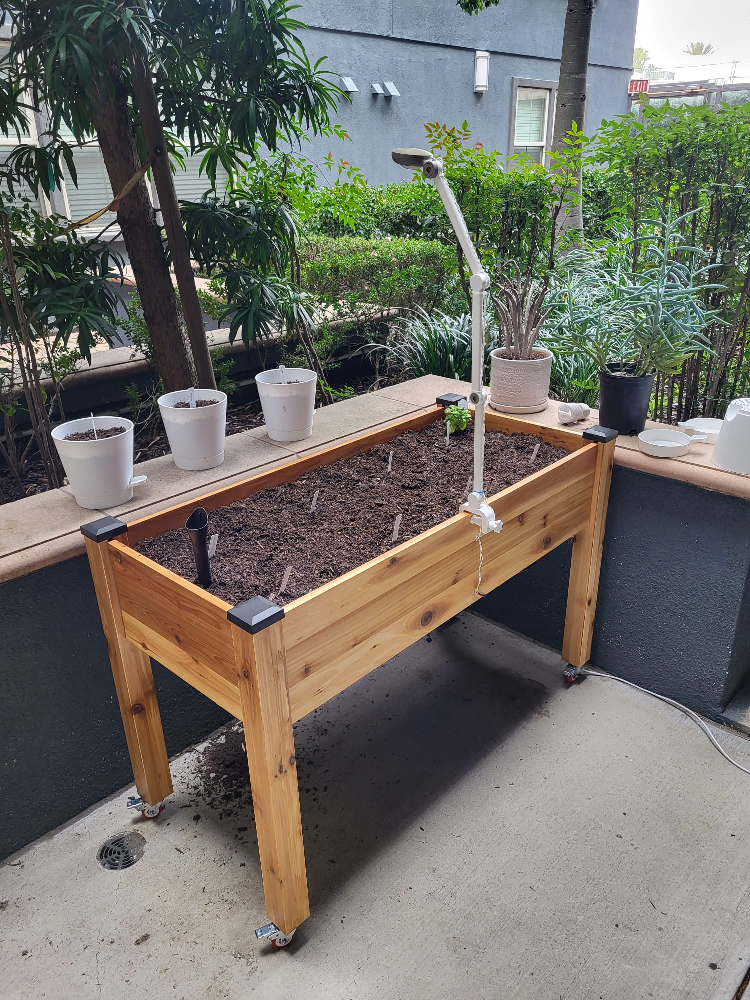
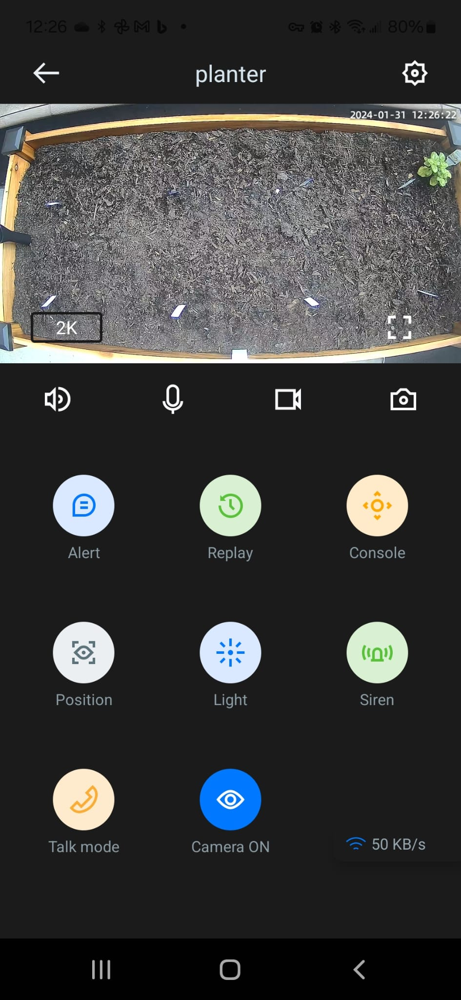
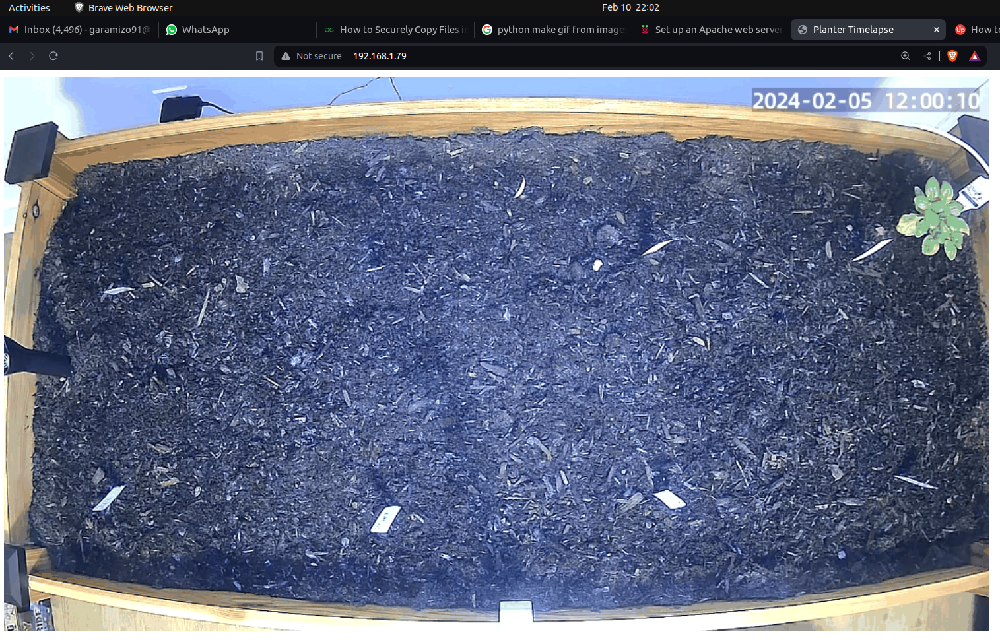
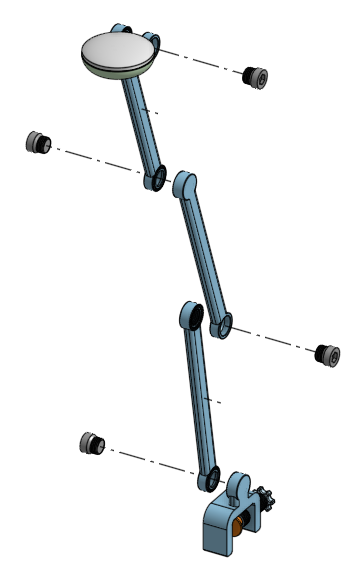
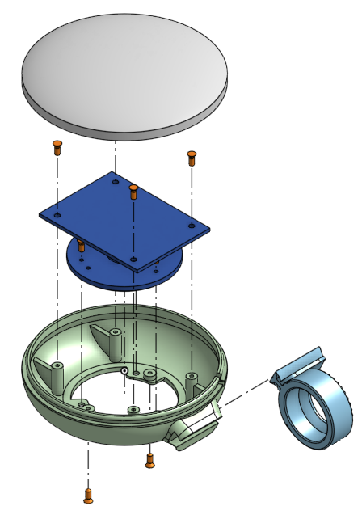
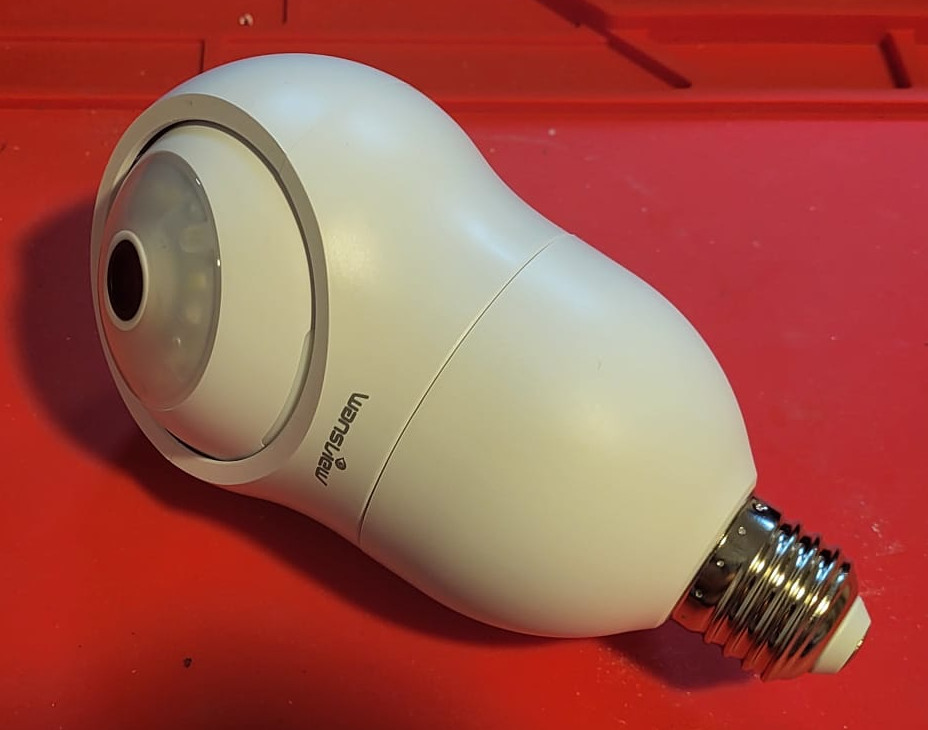
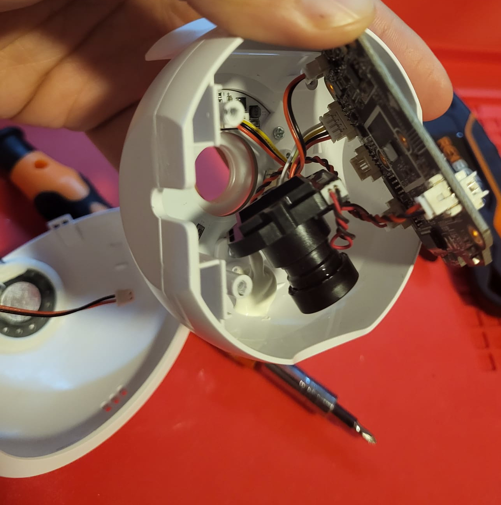
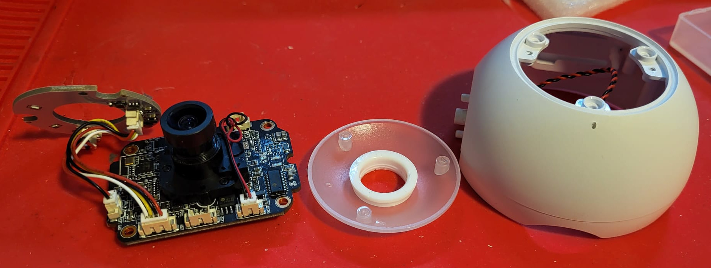
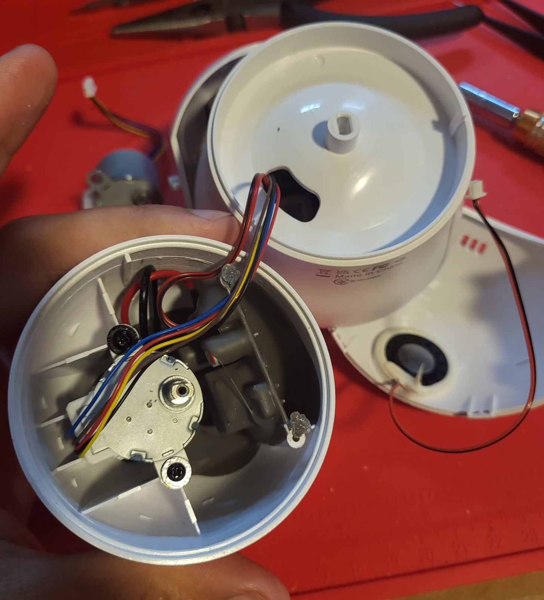

# Plant-Timelapse
Records a timelapse of plants.

An IP camera (Wansview 2K G6) is monted on a adjustable arm and stream a top view of the plants on the cloud and locally via RTSP. A SBC (single board computer) (Raspberry Pi 3B) executes a cron job every day at noon to save a timelapse of the plant. Additionally, the cloud stream support real-time view of the camera and control of the LED lights.

The SBC is kept indoors, protected from environmental damage and burglary. The arm sub-system is low cost and custom made, reducing the risk of burglary and cost of replacement.

The camera module is configured to stream locally with a RTSP protocol, which is compatible to OpenCV `VideoCapture` class. 



Figure 1. Arm-subsystem mounted on the planter


Figure 2. Sample of the top view capture



Figure 3. Screenshot of the app streaming real-time view of the planter


Figure 4. Generated gif with timelapse



Figure 5. Screen capture of local website


### Components:
- Camera module (Wansview 2K G6)
- Raised bed planter (Self-Watering Elevated Cedar planter - 23" x 49" x 30"H)
- Custom camera arm support
- Raspberry Pi 3B

## Installation

- OpenCV
- imageio
- numpy

TODO Add requirements.txt
TODO Copy apache conf instead of sym-copy for better security

```
cd /home/garamizo/Software/Plant-Timelapse
sudo ln planter.conf /etc/apache2/sites-available  # install server conf file
sudo a2ensite planter.conf  # enable website
sudo a2dissite 000-default.conf  # disable default website
sudo apache2ctl configtest  # verify configuration
sudo systemctl restart apache2  # restart webserver service
sudo systemctl status apache2  # check server
```

## Adding Cron Job

**E**dit cron job list with `$ crontab -e` and append:

```
0 * * * * python3 /home/garamizo/Software/Plant-Timelapse/cam_snapshot.py
0 0 * * * python3 /home/garamizo/Software/Plant-Timelapse/make_gif.py
``` 

to execute `cam_snapshot.py` every hour and `make_gif.py` every day at midnight(assuming this package is located at `/home/garamizo/Software`).

## Mechanical Design

Novel or interesting features:
- All custom parts are 3D printed on PLA, 0.2mm layer height
- Arm joints are adjustable by 10 deg steps
- Press fit enclosures for camera head and power supply

|  |  |
| --- | --- |
| Figure 6a. Arm assembly | Figure 6b. Head assembly |

## Camera Teardow

IP camera model *Wansview 2K G6* features 
- 3 MP (2304 x 1296 px)
- Vertical Angle of view: 50 deg
- Horizontal Angle of view: 80 deg
- LED lights
- Infrared LED
- Infrared camera filter
- *Microphone*
- *Speaker*
- *Motorized pan and tilt (2x 24BYJ48 stepper motors)*
- *Wansview App to control lights and streaming*








